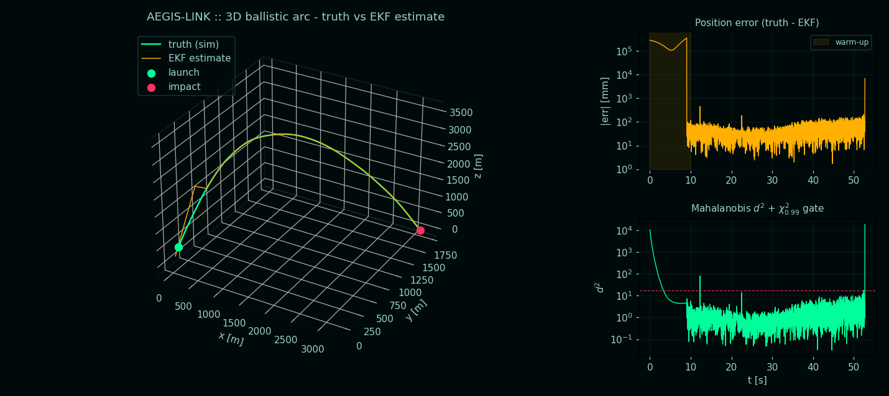
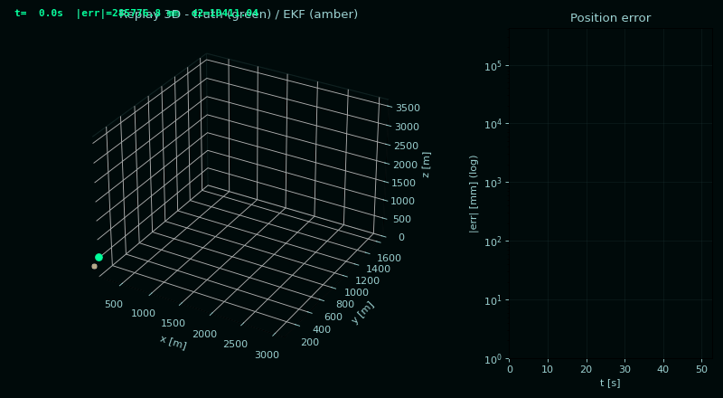

<div align="center">

# 🛰️ Project AEGIS-LINK

**Distributed real-time simulator of an EKF-based airborne-threat tracker**

*Julia (stochastic physics) ⇄ C++20 (Kalman filter) ⇄ Python (anomaly detector),
glued by a **128-byte zero-copy data link** over ZeroMQ.*

[]()
[](LICENSE)
[]()
[]()
[]()
[]()

<br/>



<sub><i>Julia simulates a noisy ballistic launch · C++ EKF reconstructs the state at ~100 Hz · Python orchestrator gates anomalies via χ² and drives the lock FSM · Python PN interceptor closes the fire-control loop (track → lock → engage → knock-down).</i></sub>

<br/><br/>



</div>

---

## Why this project exists

I'm a physicist working on **complex systems** and I'm preparing for interviews
in the **aerospace / defence sector**, where the day-to-day stack is exactly
this one:

* a **stochastic physical engine** (SDE / coloured-noise turbulence),
* a **real-time state estimator** (Kalman family), and
* an **anomaly / decision layer** sitting on top.

The literature splits these into separate textbooks. The job interview asks
you to make them talk *to each other* in a single, deterministic, 100 Hz
pipeline that survives crashes, schedulers, NTP jumps and a misbehaving
subscriber. That gap between "I know the math" and "I can ship the box" is
what AEGIS-LINK exists to bridge.

It is also a **playground** for the things I find genuinely fun about the
physics of complex systems: stochastic dynamics with non-trivial correlation
structure (Ornstein-Uhlenbeck wind), recursive Bayesian inference (the EKF
as a particular instance of message passing on a Gaussian factor graph),
and detection theory (Mahalanobis distance vs. χ² gating).

It is **not** a flight-qualified system. It *is* a complete, honest,
end-to-end prototype — which is what I want to be able to put on a screen
during a technical interview.

---

## Architecture at a glance

```
┌──────────────────────────┐    PUB tcp://*:5555    ┌──────────────────────────┐
│ simulation_engine (Julia)│ ─────────────────────▶ │ tracking_system  (C++20) │
│  SDE: ballistic + OU wind│   raw 128-byte frames  │  EKF, CA model, χ² gate  │
│  100 Hz wall-paced       │     (zero-copy)        │  Joseph-form update      │
└──────────────────────────┘                        └────────────┬─────────────┘
              │                                                  │ PUB tcp://*:5556
              │                                                  ▼
              │                                  ┌──────────────────────────────┐
              │                                  │ ai_orchestrator (Python 3.12)│
              │                                  │  Mahalanobis d² + streak gate│
              │                                  │  lock FSM (SEARCH/TRK/LOCKED)│
              │                                  │  CSV log for analysis        │
              │                                  └────────────┬─────────────────┘
              │                                               │
              ▼                                               ▼
┌──────────────────────────────┐  ◀────────────────  ┌──────────────────────────────┐
│  viz_live.py (live tactical) │   PUB tcp://*:5557  │ engagement_engine  (Python)  │
│  analysis.ipynb (post-mortem)│  EngagementPacket   │  PN guidance + 3-DoF intc    │
│  shows interceptor, KILL/MISS│ ◀───────────────────│  KILL when CPA < lethal r    │
└──────────────────────────────┘                     └──────────────────────────────┘
```

Four asynchronous OS processes, three different runtimes, **one shared C-ABI
struct**: [shared/messages.h](shared/messages.h) — 128 bytes, two cache
lines, no padding ambiguity, identical wire layout in all four. The new
`EngagementPacket` (`producer_id = 4`) is a typedef alias of `TrackPacket`:
same offsets, same `static_assert`s, semantically reinterpreting `state[]`
as interceptor (pos, vel) and `cov_diag[]` as fire-control telemetry
(time-to-go, predicted miss, range, closing speed, fuel fraction,
commanded |a|).

---

## Module map

| Path | Role | Language / Stack |
|---|---|---|
| [shared/messages.h](shared/messages.h) | C-ABI 128-byte `TrackPacket` + `EngagementPacket` typedef, cache-aligned, `static_assert`-checked offsets | C / C++ |
| [simulation_engine/main.jl](simulation_engine/main.jl) | SDE: ballistic dynamics + 3-D Ornstein-Uhlenbeck wind, ZMQ publisher | Julia 1.11+ (DifferentialEquations.jl, StochasticDiffEq, StaticArrays, ZMQ.jl) |
| [tracking_system/main.cpp](tracking_system/main.cpp) | 9-D Constant-Acceleration EKF, closed-form `F(dt)` / `Q(dt)`, Joseph-form update, χ²-gated innovation | C++20 + Eigen3 + cppzmq |
| [tracking_system/CMakeLists.txt](tracking_system/CMakeLists.txt) | Ninja build, `-O3 -march=native`, no fast-math (Kalman needs IEEE-754 monotonicity) | CMake ≥ 3.20 |
| [ai_orchestrator/main.py](ai_orchestrator/main.py) | Real-time fusion: Mahalanobis distance + χ² gate + 3-frame streak filter + **lock FSM** (`SEARCH → TRACKING → LOCKED`), CSV writer | Python 3.12 + pyzmq + numpy |
| [engagement_engine/main.py](engagement_engine/main.py) | **Fire-control loop**: PN guidance on the EKF estimate, 3-DoF interceptor (RK4, thrust/drag/mass-burn), KILL/MISS decisioning, publishes `EngagementPacket` on `:5557` | Python 3.12 + pyzmq + numpy + pyyaml |
| [engagement_engine/config.yaml](engagement_engine/config.yaml) | Interceptor parameters (mass, thrust, max-G, lethal radius, N′) | YAML |
| [viz_live.py](viz_live.py) | Live "tactical radar" 3-D scene with 3σ ellipsoid, interceptor track, LOS line, fire-control HUD, 30 FPS | matplotlib + pyzmq |
| [analysis.ipynb](analysis.ipynb) | 12-section post-run notebook (sanity checks, χ² consistency test, residual stats, replay GIF, interactive Plotly scene, **engagement performance**) | Jupyter / pandas / matplotlib / plotly |
| [run_demo.sh](run_demo.sh) | One-click orchestrator: starts the four processes, waits for the binds, writes `run.csv` + `engagement.csv`, cleans up on exit | bash |
| [mc_demo.sh](mc_demo.sh) | **Monte-Carlo driver**: runs N independent engagements, aggregates Pk and miss-distance into `mc_results.csv` | bash |
| [install_all.sh](install_all.sh) | Idempotent provisioning for WSL2 / Ubuntu 22.04+ | bash + apt + juliaup |

---

## Quick start (3 commands)

```bash
./install_all.sh                 # one-time: apt + juliaup + venv + cmake build
./run_demo.sh 60                 # 60 s end-to-end run -> run.csv
jupyter lab analysis.ipynb       # explore the results
```

`run_demo.sh` brings up the simulator, the tracker and the orchestrator in
sequence, waits for `:5555` to be in `LISTEN`, runs the orchestrator for the
requested wall-clock duration and tears everything down on exit.

### Live view during the run

Open a second terminal *while the demo is running*:

```bash
source .venv/bin/activate
python viz_live.py
```

You get a dark "tactical radar" window with:

* truth trajectory (neon green) vs EKF estimate (amber) in 3-D
* a translucent **3σ uncertainty sphere** anchored on the latest estimate
* three side panels scrolling at 30 FPS: position error, Mahalanobis $d^2$
  (log scale, with $\chi^2$ thresholds), altitude truth-vs-estimate
* a **MANEUVER DETECTED** banner that lights up when the orchestrator
  confirms an alert

It's pure matplotlib + pyzmq — runs comfortably on an Intel Iris Xe in
WSL2 (the Wayland backend exposed by WSLg is auto-detected).

---

## What you actually see

A nominal 60-second run produces a clean ballistic arc:

* launch from the ground at $\mathbf{v}_0 = (50, 0, 250)$ m/s
* apogee ~ 3.2 km at $t \approx 25$ s
* ground impact at $t \approx 51$ s (the simulator terminates cleanly there)

After the EKF warm-up (≈ 10 s — the filter starts from $P_0 = 10^3 \cdot I$
and needs that long to learn $a_z = -g$), the in-regime tracking accuracy is:

| metric | value (typical 60 s run) |
|---|---|
| 3-D RMSE on position | **20 – 100 mm** |
| sample rate | **100.0 ± 0.3 Hz** |
| end-to-end Δt p99 | **< 12 ms** |
| median $d^2$ | 1.3 (theoretical: 5.35) |
| frames above $\chi^2_{0.99}$ | ~ 2 % |

The **median $d^2$ being below the theoretical 5.35** is a legitimate
diagnostic finding documented in the notebook: the filter is slightly
over-confident (its $P$ is tighter than it should be, an artifact of how
generously the simulator declares its truth-side covariance). You can fix
it by increasing `Q_JERK_PSD` in [tracking_system/main.cpp](tracking_system/main.cpp)
— a one-line change with a clear physical interpretation.

This is the kind of "read the numbers, understand the trade-off" loop the
project is built to make trivially easy.

---

## The physics, in two screens

### Simulator — stochastic dynamics

The drone state $\mathbf{x} = (\mathbf{r}, \mathbf{v}, \mathbf{W}) \in \mathbb{R}^9$
evolves as

$$
\begin{aligned}
d\mathbf{r} &= \mathbf{v}\,dt \\
d\mathbf{v} &= \big(\mathbf{a}_{\text{cmd}} + \mathbf{W} - g\hat{\mathbf{z}}\big)\,dt \\
d\mathbf{W} &= -\theta\,\mathbf{W}\,dt + \sigma_w\,d\mathbf{B}_t
\end{aligned}
$$

where $\mathbf{W}$ is a 3-D **Ornstein-Uhlenbeck** process modelling
*coloured* (band-limited) wind acceleration with correlation time
$\tau = 1/\theta$. White noise on velocity would be unphysical (infinite
power); OU is the simplest realistic atmospheric-gust model and the same
one used in turbulent-flow surrogate models in complex-systems literature.

Solver: `SOSRI` from **StochasticDiffEq.jl** (Stochastic Runge–Kutta for
additive-noise SDEs, strong order 1.5). The integration loop is
**wall-clock paced** so it emits exactly one packet per 10 ms of real time
— without that, ten minutes of simulated flight finish in less than a
second of wall time and no subscriber can keep up.

### Tracker — Extended Kalman Filter, CA model

Internal state is 9-D: position, velocity and **acceleration** (the
3-D Constant-Acceleration model lets the filter explicitly track gravity
and ride out any sub-jerk manoeuvre).

The transition $F(dt)$ and process noise $Q(dt)$ are **closed-form**
(Van Loan), not Taylor-expanded:

$$
F(dt) = \begin{bmatrix} I & dt\,I & \tfrac12 dt^2 I \\ 0 & I & dt\,I \\ 0 & 0 & I \end{bmatrix},
\qquad
Q(dt) = q_a \begin{bmatrix} \tfrac{dt^5}{20}I & \tfrac{dt^4}{8}I & \tfrac{dt^3}{6}I \\ \cdot & \tfrac{dt^3}{3}I & \tfrac{dt^2}{2}I \\ \cdot & \cdot & dt\,I \end{bmatrix}
$$

Update uses the **Joseph form** (numerically stable: $P$ stays SPD even
with ill-conditioned $K$) and a **χ² gate at 99 %** on the squared
Mahalanobis distance of the innovation — out-of-gate measurements are
*rejected* (prediction kept), so a single bad sensor frame cannot poison
the filter.

### Orchestrator — anomaly / manoeuvre detector + lock FSM

For each estimate-truth pair (matched by producer-side TAI timestamp
within 50 ms), the orchestrator computes

$$d^2 = \boldsymbol{\delta}^\top S^{-1} \boldsymbol{\delta},
\quad S \approx \mathrm{diag}(P_{\text{est}} + R_{\text{sensor}}).$$

A **3-frame consecutive streak** above the threshold
$\chi^2_{6,0.99} \approx 16.81$ confirms a MANEUVER — the streak filter
rejects single-frame outliers due to packet jitter or extreme wind gusts.

On top of the anomaly detector, the orchestrator runs a small
**fire-control lock state machine**:

```
SEARCH ──(in-gate AND σ_p < 5 m, for 25 consecutive frames)──▶ TRACKING
TRACKING ──(criteria continue to hold for 50 more frames)────▶ LOCKED
LOCKED ──(5 consecutive out-of-gate frames | σ explodes | 200 ms gap)──▶ SEARCH
```

The `LOCKED` state is exposed both on the CSV (`lock_state` column) and
on the next downstream stream as bit `AEGIS_FLAG_LOCKED = 0x04`.

---

## Fire-control loop — track / hook / engage / knock-down

The fourth process, `engagement_engine/main.py`, closes the loop with a
**simulated Proportional-Navigation interceptor**.

### Guidance — true Proportional Navigation

Let $\mathbf{r}$ be the relative position of the (estimated) target wrt
the interceptor and $\mathbf{v}_\text{rel}$ its derivative. The LOS
rotation rate is

$$\boldsymbol{\Omega}_\text{LOS} = \frac{\mathbf{r} \times \mathbf{v}_\text{rel}}{|\mathbf{r}|^2}$$

and the closing speed $V_c = -\mathbf{\hat{u}}_\text{LOS}\cdot\mathbf{v}_\text{rel}$.
True PN commands a lateral acceleration

$$\mathbf{a}_\text{cmd} = N' \, V_c \, \big(\boldsymbol{\Omega}_\text{LOS} \times \mathbf{\hat{u}}_\text{LOS}\big),
\qquad N' \in [3,5]$$

saturated at `max_lateral_g * g` (default 40 g). Crucially, the guidance
closes on the **EKF estimate**, never on the truth — the whole point of
having a tracker is to feed it to a controller that cannot see the
ground state.

### Interceptor dynamics — 3-DoF point mass, RK4

$$
\begin{aligned}
\dot{\mathbf{r}} &= \mathbf{v} \\
\dot{\mathbf{v}} &= \frac{T - D}{m}\,\mathbf{\hat{v}} + \mathbf{a}_\text{cmd} + \mathbf{g} \\
\dot{m}          &= -T / v_e  \quad\text{(while propellant remains, else}\ T = 0\text{)}
\end{aligned}
$$

with quadratic drag $D = C_d \cdot A \cdot |\mathbf{v}|^2$ and gravity
$\mathbf{g} = (0,0,-g)$. The constant exhaust velocity $v_e$ gives a
constant mass-flow $\dot{m} = T/v_e$ during the boost phase. All
parameters live in [`engagement_engine/config.yaml`](engagement_engine/config.yaml).

### Termination — KILL / MISS

The CPA (closest point of approach) is tracked online. The engagement
terminates as:

* **`KILL`** when `CPA < lethal_radius_m` (default 5 m), or
* **`MISS`** on flight-time exceeded (default 30 s), or when range starts
  increasing past CPA + 50 m (the interceptor has overshot).

On terminal state the engine refines CPA against the **truth** (not the
estimate it was guiding on), so the reported number is the physically
honest one — independent of EKF over-/under-confidence.

### Monte-Carlo evaluation

Run a batch:

```bash
./mc_demo.sh 20     # 20 independent engagements, ~45 s each
```

Each engagement re-seeds the Julia SDE, spawns the full 4-process
pipeline, parses the outcome, and appends a row to `mc_results.csv`
with columns `run_idx, outcome, cpa_m, flight_time_s, fuel_used_pct,
pred_miss_m`. The kill probability $P_k$ is printed at the end and the
notebook (§ 12) plots the miss-distance and time-to-kill histograms.

---

## The 128-byte data link

[shared/messages.h](shared/messages.h) defines the wire contract:

```
offset  size   field
------  ----   ----------------------------------------------------------
   0      4    packet_id            (monotonic per-publisher counter)
   4      4    producer_id          (1=sim, 2=tracker, 3=orchestrator)
   8      8    timestamp_ns         (CLOCK_TAI ns since Unix epoch)
  16     48    state[6]             (x,y,z, vx,vy,vz)        [m, m/s]
  64     48    cov_diag[6]          (sigma^2 of the 6 state comps)
 112      2    schema_version
 114      2    flags                (bit 0 = MANEUVER, bit 1 = LOST_TRK)
 116     12    _padding             (zeroed)
total  128
```

Compile-time `static_assert`s nail down `sizeof(TrackPacket) == 128` and
the offset of every field. **No serialisation** in any of the three
runtimes: Julia uses `unsafe_store!` on a `Ptr{UInt8}`, C++ does a `memcpy`
of the struct, Python uses `struct.unpack` with a frozen format string.
The 64-byte `alignas` makes the struct exactly two x86_64 cache lines.

---

## Clock synchronisation across asynchronous processes

This is the part most prototypes get wrong. AEGIS-LINK enforces three
rules — exactly what you'd find in a real sensor-fusion stack:

**1. Producer stamps the packet, never the consumer.**
The C++ tracker computes `dt = (in.ts - last.ts) * 1e-9` from the
*Julia producer's* timestamp, so the filter is immune to ZMQ buffering,
scheduler preemption and consumer-side jitter — the very things that
destroy a wall-clock-based EKF.

**2. One single, monotonic, leap-second-free time base: `CLOCK_TAI`.**
Linux exposes it via `clock_gettime(CLOCK_TAI, …)`; Julia adds a +37 s
offset to `time()`. TAI is monotonic across leap seconds (POSIX time
*repeats* a second on a leap insertion — death for an EKF). On WSL2
without functional `chrony` we fall back to `CLOCK_REALTIME + 37 s`,
which is correct in steady state.

**3. Bounded matching window.**
The orchestrator keeps a 50 ms ring buffer of recent truth packets and
matches each estimate to the closest-in-time truth. Pairs with lag
> 50 ms are dropped (the EKF was running on stale data, the comparison
would lie).

For sub-microsecond requirements (multi-host deployments) replace
`chrony` with **PTP / `linuxptp`** on a hardware-timestamped NIC: the
data link is already nanosecond-resolved.

---

## Repository layout

```
AEGIS-LINK/
├── shared/messages.h               # wire contract (single source of truth)
├── simulation_engine/
│   ├── main.jl                     # SDE physics + ZMQ publisher
│   └── Project.toml                # Julia env (Manifest is .gitignore'd)
├── tracking_system/
│   ├── main.cpp                    # EKF (9-D CA, Joseph form, χ² gate)
│   └── CMakeLists.txt              # Ninja, -O3 -march=native, no fast-math
├── ai_orchestrator/main.py         # Mahalanobis + streak detector + lock FSM + CSV
├── engagement_engine/
│   ├── main.py                     # PN interceptor (3-DoF RK4, KILL/MISS FSM)
│   └── config.yaml                 # interceptor & guidance parameters
├── viz_live.py                     # live 3-D tactical radar (matplotlib)
├── analysis.ipynb                  # post-run notebook (12 sections incl. Pk)
├── install_all.sh                  # one-shot provisioning (WSL2 / Ubuntu)
├── run_demo.sh                     # one-click end-to-end demo (4 processes)
├── mc_demo.sh                      # Monte-Carlo Pk driver (N engagements)
├── README.md
└── LICENSE
```

---

## Roadmap / what's intentionally next

- [x] **Fire-control loop**: PN interceptor on the EKF estimate, KILL/MISS
      decisioning, Monte-Carlo Pk evaluation (see "Fire-control loop"
      section above). *Done in this revision.*
- [ ] Replace the constant `Q_JERK_PSD` with an **adaptive process-noise**
      scheme (IMM or Sage-Husa) so the filter calibrates itself instead
      of being tuned by hand.
- [ ] Multi-target version: replace the single EKF with a **JPDA / GM-PHD**
      filter and broadcast the resulting track set on a fan-out ZMQ socket.
- [ ] Port `engagement_engine` to C++ for sub-millisecond guidance loop
      latency (current Python loop is comfortable at 100 Hz but pays a
      GIL tax under heavy ZMQ traffic).
- [ ] Replace the χ² gate with a **Bayesian model-comparison** alert
      (CA vs CV vs Singer) so the orchestrator outputs *which* manoeuvre
      family is firing, not just "something is off".
- [ ] Hardware-in-the-loop: feed real IMU traces (or an `rtl-sdr` ADS-B
      stream) into the same `TrackPacket`. The data link doesn't change.
- [ ] CI: GitHub Actions matrix building C++ on `ubuntu-latest` and
      smoke-testing the Julia simulator headlessly.

---

## License

[MIT](LICENSE) — use it, fork it, take it to your next interview.

If you find a bug, an unphysical assumption, or a numerical sloppiness,
open an issue: I want to know about it.
